 
## 查看主页获取源码

### 一、作品包含

源码+数据库+设计文档万字+PPT+全套环境和工具资源+部署教程

### 二、项目技术

前端技术：Html、Css、Js、Vue、Element-ui

数据库：MySQL

后端技术：Java、Spring Boot、MyBatis

  

### 三、运行环境

开发工具：IDEA/eclipse

数据库：MySQL5.7

数据库管理工具：Navicat10以上版本

环境配置软件： JDK1.8+Maven3.6.3

前端Nodejs：14

### 四、项目介绍
项目编号：springbootA156

高校本科生学习成长记录系统是为了适应现代教育信息化需求而设计开发的，它通过集成先进的信息技术，有效地记录和管理学生的学术表现，旨在提升学生管理效率，促进教育质量提升，同时为学生的个人发展提供数据支持和参考。

系统分为管理员和用户
管理员的功能：个人中心、用户管理、活动信息管理、干部信息管理、奖惩信息管理、奖学金评定管理、出勤信息管理、成绩信息管理、行为测评管理。
用户的功能：首页、个人中心、活动信息管理、干部信息管理、奖惩信息管理、奖学金评定管理、出勤信息管理、成绩信息管理、行为测评管理。

### 五、运行截图

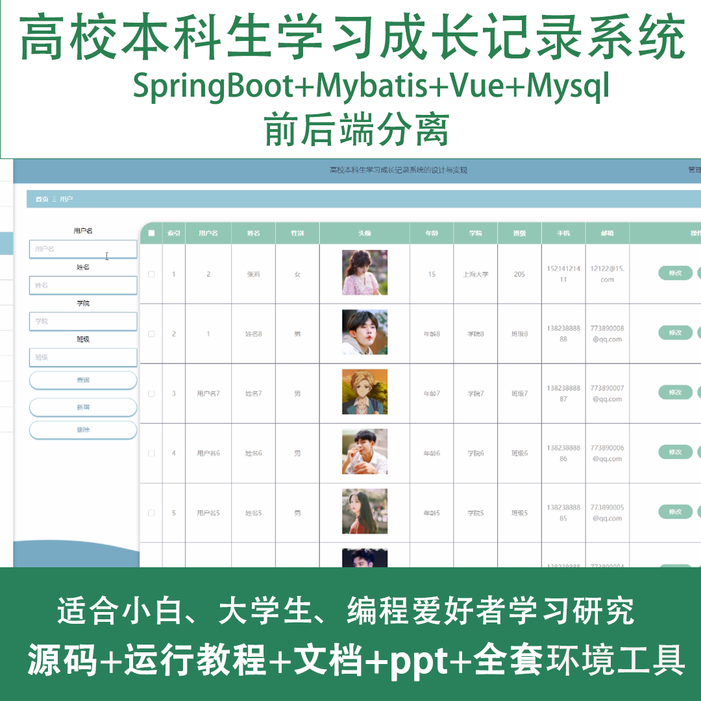
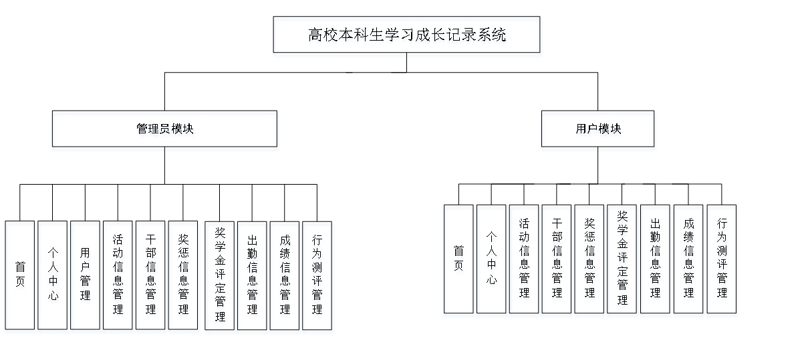
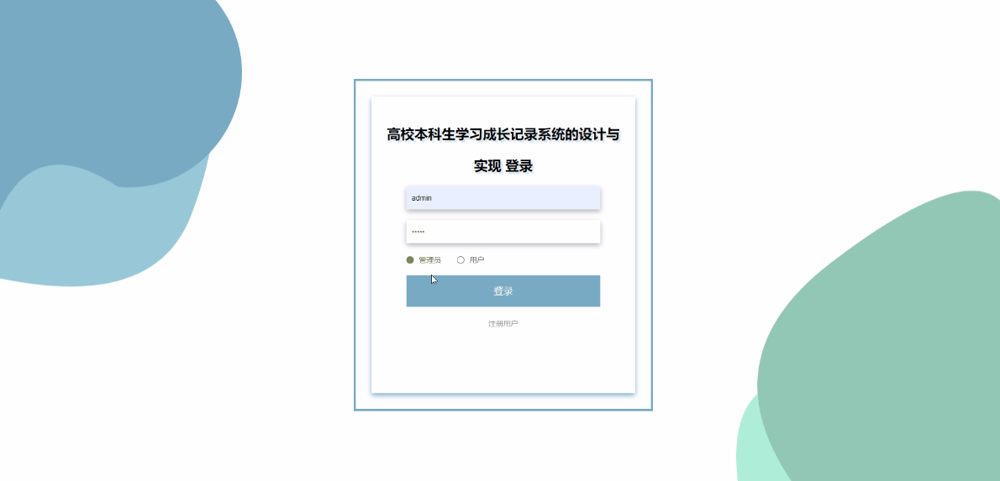
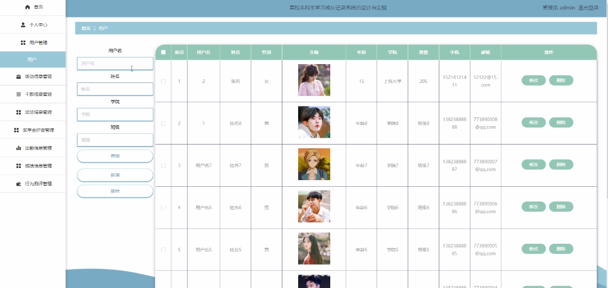
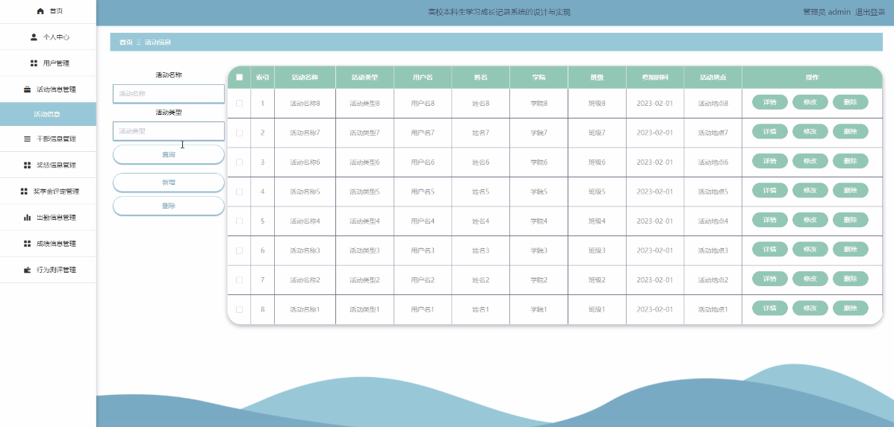
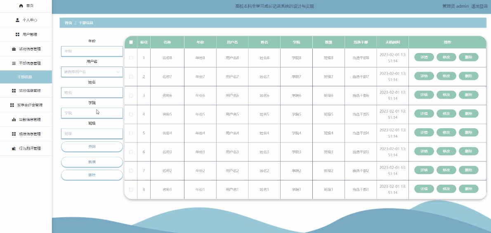
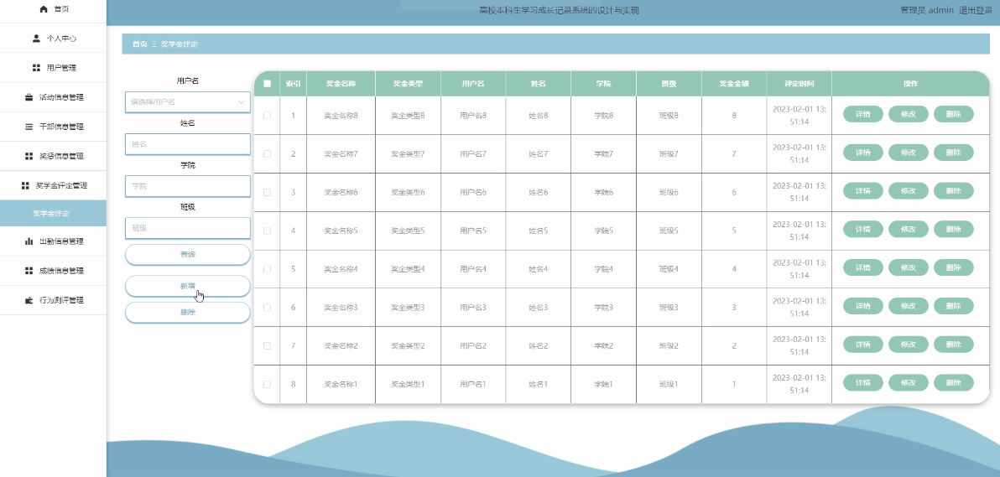
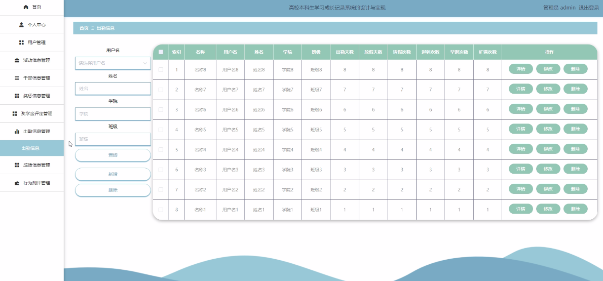
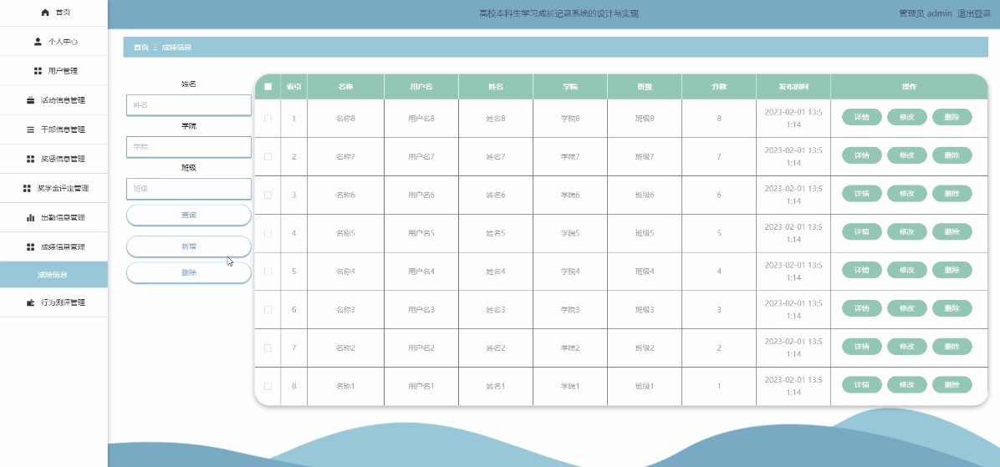
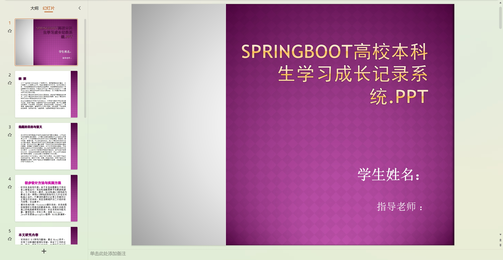
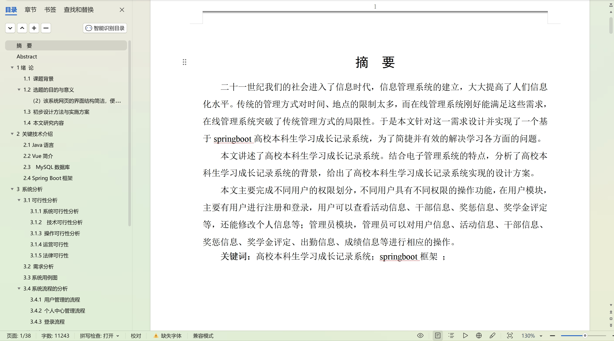

  
